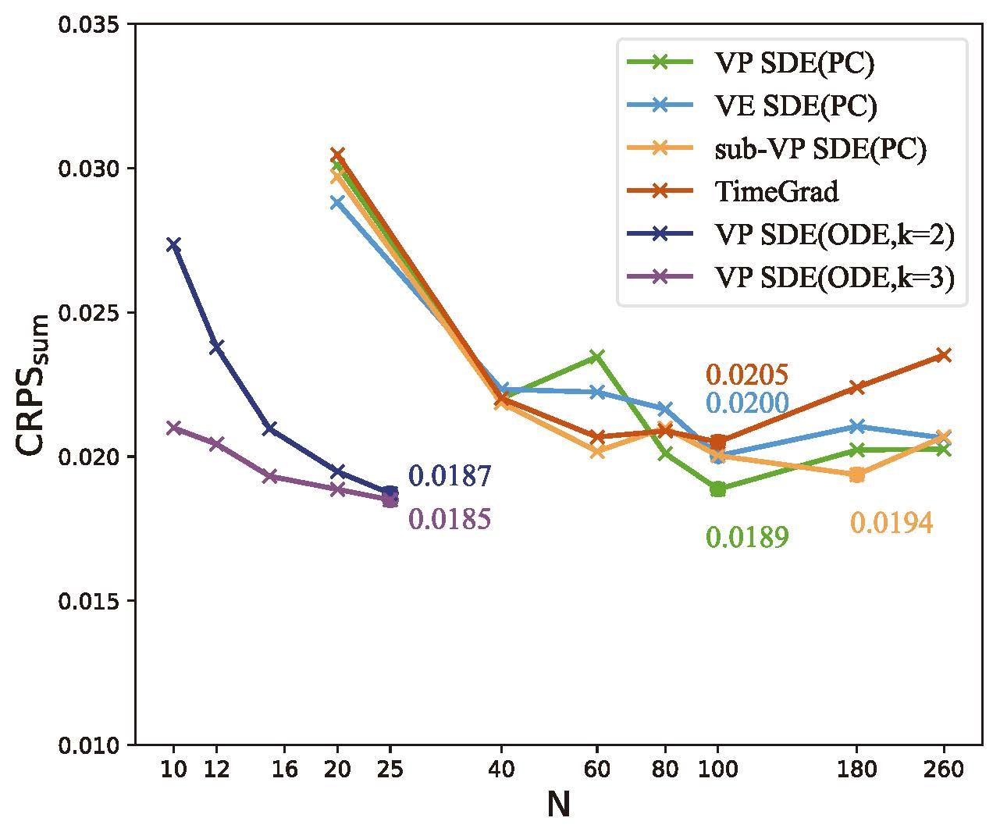

# ScoreGradPred

> ScoreGrad: Multivariate Probabilistic Time Series Forecasting with Continuous Energy-based Generative Models [Paper](https://arxiv.org/abs/2106.10121)

## Dependencies

See requirements

## Usage

> ScoreGrad is based on [GluonTS](https://github.com/awslabs/gluon-ts) and [PytorchTS](https://github.com/zalandoresearch/pytorch-ts)

### Load datasets

```python
dataset = get_dataset("electricity_nips", regenerate=False)
train_grouper = MultivariateGrouper(max_target_dim=min(2000, int(dataset.metadata.feat_static_cat[0].cardinality)))

test_grouper = MultivariateGrouper(num_test_dates=int(len(dataset.test)/len(dataset.train)),
                                   max_target_dim=min(2000, int(dataset.metadata.feat_static_cat[0].cardinality)))

dataset_train = train_grouper(dataset.train)
dataset_test = test_grouper(dataset.test)
```

### Create estimator

* Configuration for dataset can be set in folder `config`, we list a demo for `Electricity`


```python
estimator = ScoreGradEstimator(
    input_size=config.input_size,
    freq=dataset.metadata.freq,
    prediction_length=dataset.metadata.prediction_length,
    target_dim=int(dataset.metadata.feat_static_cat[0].cardinality),
    context_length=dataset.metadata.prediction_length,
    num_layers=config.num_layers,
    num_cells=config.num_cells,
    cell_type='GRU',
    num_parallel_samples=config.num_parallel_samples,
    dropout_rate=config.dropout_rate,
    conditioning_length=config.conditioning_length,
    diff_steps=config.modeling.num_scales,
    beta_min=config.modeling.beta_min,
    beta_end=config.modeling.beta_max,
    residual_layers=config.modeling.residual_layers,
    residual_channels=config.modeling.residual_channels,
    dilation_cycle_length=config.modeling.dilation_cycle_length,
    scaling=config.modeling.scaling,
    md_type=config.modeling.md_type,
    continuous=config.training.continuous,
    reduce_mean=config.reduce_mean,
    likelihood_weighting=config.likelihood_weighting,
    config=config,
    trainer=Trainer(
        epochs=config.epochs,
        batch_size=config.batch_size,
        num_batches_per_epoch=config.num_batches_per_epoch,
        learning_rate=config.learning_rate,
        decay=config.weight_decay,
        device=config.device,
        wandb_mode='disabled',
        config=config)
)
```

### Train or load model for prediction

```python
if config.train:
    train_output = estimator.train_model(dataset_train, num_workers=0)
    predictor = train_output.predictor

else:
    assert config.path is not None
    trainnet = estimator.create_training_network(config.device)
    trainnet.load_state_dict(torch.load(config.path))
    transformation = estimator.create_transformation()
    predictor = estimator.create_predictor(transformation, trainnet, config.device)
```

### Prediction and evaluation

```python
forecast_it, ts_it = make_evaluation_predictions(dataset=dataset_test,
                                                 predictor=predictor,
                                                 num_samples=100)
forecasts = list(forecast_it)
targets = list(ts_it)


evaluator = MultivariateEvaluator(quantiles=(np.arange(20)/20.0)[1:],
                                  target_agg_funcs={'sum': np.sum})

agg_metric, item_metrics = evaluator(targets, forecasts, num_series=len(dataset_test))
```

## Evaluation on `Electricity`

```bash
python run_elec.py --data elec --name ddpm_c --beta1 0.01 --beta2 15 --scale 200 --epochs 40 --batch 64
```
## Fast sampling option
* We add a conditional ODE sampler for acceleration of the prediction process. It takes only around 20 steps for sampling and it can increase the prediciton speed by up to 4.9 times without performance degradation.


